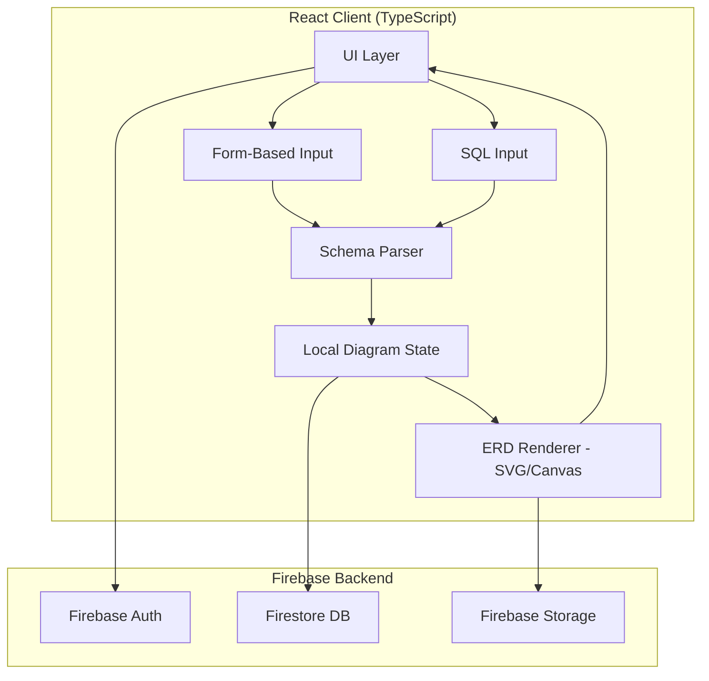
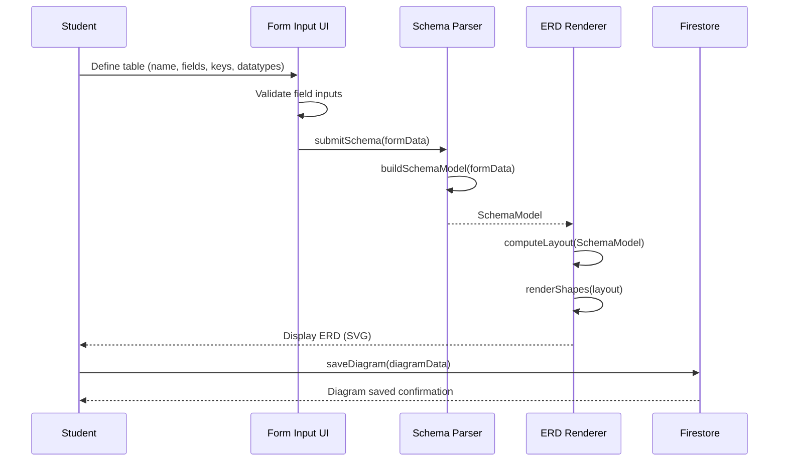
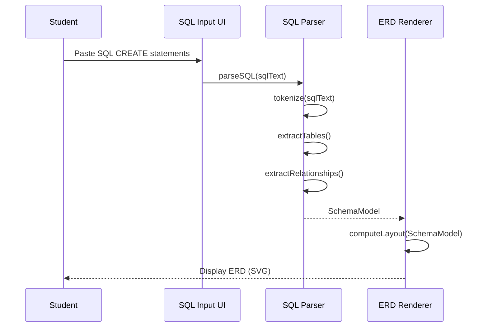
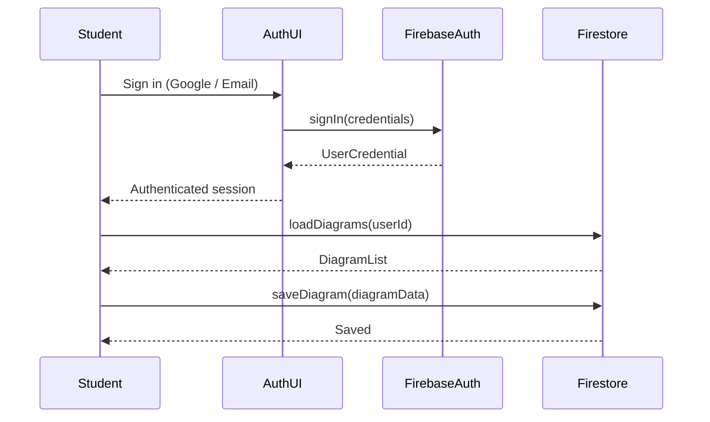

# Design Document: ERD Generator Platform

## Overview

The ERD Generator Platform is a web application built with React and Firebase that enables IT students to create Entity Relationship Diagrams (ERDs) using standard Chen notation. Users can define their database structure either through a guided form-based interface (defining tables, fields, keys, and datatypes) or by pasting a raw SQL CREATE statement, and the platform renders a well-formatted, accurate ERD with proper shapes, cardinality labels, and relationship lines.

The platform targets IT students who need to visualize database schemas for coursework, projects, or study. It removes the friction of manual diagramming tools by automating layout and shape selection based on the schema definition, while supporting the full range of Chen notation symbols including weak entities, multivalued attributes, and all standard cardinality notations (1-1, 1-M, M-1, M-M).

Firebase provides authentication and persistent storage so students can save, revisit, and share their diagrams. The React frontend handles all diagram rendering client-side using a canvas or SVG-based rendering engine, ensuring fast, interactive feedback as users build their schemas.

---

## Architecture



---

## Sequence Diagrams

### Flow 1: Form-Based ERD Creation



### Flow 2: SQL-Based ERD Creation



### Flow 3: Authentication & Diagram Persistence



---

## Components and Interfaces

### Component 1: SchemaFormEditor

**Purpose**: Provides a structured form UI for defining entities, attributes, and relationships without writing SQL.

**Interface**:
```typescript
interface SchemaFormEditorProps {
  initialSchema?: SchemaModel
  onChange: (schema: SchemaModel) => void
  onSubmit: (schema: SchemaModel) => void
}

interface EntityFormData {
  id: string
  name: string
  isWeak: boolean
  attributes: AttributeFormData[]
}

interface AttributeFormData {
  id: string
  name: string
  dataType: DataType
  isKey: boolean
  isMultivalued: boolean
  isNullable: boolean
}

interface RelationshipFormData {
  id: string
  name: string
  isWeak: boolean
  entityA: string        // entity id
  entityB: string        // entity id
  cardinalityA: Cardinality
  cardinalityB: Cardinality
}
```

**Responsibilities**:
- Render dynamic form rows for adding/removing entities and attributes
- Validate field names, data types, and key constraints before submission
- Emit updated `SchemaModel` on every change for live preview

---

### Component 2: SQLInputEditor

**Purpose**: Accepts raw SQL CREATE TABLE statements and delegates parsing to the SQL parser service.

**Interface**:
```typescript
interface SQLInputEditorProps {
  onParse: (schema: SchemaModel) => void
  onError: (errors: ParseError[]) => void
}

interface ParseError {
  line: number
  column: number
  message: string
}
```

**Responsibilities**:
- Provide a syntax-highlighted textarea for SQL input
- Trigger parsing on user action (button click or debounced input)
- Display inline parse errors with line/column references

---

### Component 3: ERDRenderer

**Purpose**: Converts a `SchemaModel` into a visual ERD using Chen notation shapes rendered as SVG.

**Interface**:
```typescript
interface ERDRendererProps {
  schema: SchemaModel
  options?: RenderOptions
  onExport?: (format: ExportFormat) => void
}

interface RenderOptions {
  layoutAlgorithm: 'force-directed' | 'hierarchical' | 'grid'
  showDataTypes: boolean
  showCardinality: boolean
  theme: 'light' | 'dark'
}

type ExportFormat = 'svg' | 'png' | 'pdf' | 'jpg'
```

**Responsibilities**:
- Map each schema element to its correct Chen notation shape
- Compute node positions using the selected layout algorithm
- Render relationship lines with cardinality labels at endpoints
- Support pan, zoom, and node drag interactions
- Expose export functionality

---

### Component 4: DiagramManager

**Purpose**: Handles saving, loading, and listing diagrams from Firestore for authenticated users.

**Interface**:
```typescript
interface DiagramManagerProps {
  userId: string
  onLoad: (diagram: SavedDiagram) => void
}

interface SavedDiagram {
  id: string
  name: string
  schema: SchemaModel
  createdAt: Timestamp
  updatedAt: Timestamp
  ownerId: string
}
```

**Responsibilities**:
- List all diagrams belonging to the current user
- Save new diagrams and update existing ones in Firestore
- Handle optimistic UI updates and error rollback

---

### Service: SQLParser

**Purpose**: Parses SQL CREATE TABLE statements into a `SchemaModel`.

**Interface**:
```typescript
interface SQLParserService {
  parse(sql: string): ParseResult
}

interface ParseResult {
  schema: SchemaModel | null
  errors: ParseError[]
}
```

---

### Service: LayoutEngine

**Purpose**: Computes x/y positions for all nodes in the ERD given a `SchemaModel`.

**Interface**:
```typescript
interface LayoutEngine {
  compute(schema: SchemaModel, options: LayoutOptions): LayoutResult
}

interface LayoutResult {
  nodes: Map<string, NodePosition>
  edges: EdgePath[]
}

interface NodePosition {
  x: number
  y: number
  width: number
  height: number
}

interface EdgePath {
  fromId: string
  toId: string
  points: Point[]
  cardinalityLabel: string
}
```

---

## Data Models

### SchemaModel

```typescript
interface SchemaModel {
  entities: Entity[]
  relationships: Relationship[]
  version: string
}

interface Entity {
  id: string                    // UUID
  name: string                  // Non-empty, unique within schema
  isWeak: boolean               // Renders as double rectangle
  attributes: Attribute[]
}

interface Attribute {
  id: string
  entityId: string
  name: string
  dataType: DataType
  isKey: boolean                // Primary key — renders as underlined label
  isMultivalued: boolean        // Renders as double ellipse
  isNullable: boolean
  isDerived: boolean            // Renders as dashed ellipse
}

interface Relationship {
  id: string
  name: string
  isWeak: boolean               // Renders as double diamond
  entityAId: string
  entityBId: string
  cardinalityA: Cardinality     // Cardinality on entity A's side
  cardinalityB: Cardinality     // Cardinality on entity B's side
  attributes: Attribute[]       // Relationship attributes (if any)
}

type DataType =
  | 'INT' | 'BIGINT' | 'SMALLINT'
  | 'VARCHAR' | 'TEXT' | 'CHAR'
  | 'BOOLEAN'
  | 'DATE' | 'DATETIME' | 'TIMESTAMP'
  | 'FLOAT' | 'DOUBLE' | 'DECIMAL'
  | 'UUID'

type Cardinality = '1' | 'M' | 'N'
```

**Validation Rules**:
- `Entity.name` must be non-empty and unique within the schema
- Each entity must have at least one attribute
- A non-weak entity must have exactly one key attribute
- A weak entity must have a corresponding weak relationship
- `Relationship.entityAId` and `entityBId` must reference existing entity IDs
- `entityAId !== entityBId` (no self-referencing relationships in v1)

---

### Chen Notation Shape Mapping

```typescript
type ChenShape =
  | 'rectangle'         // Entity
  | 'double-rectangle'  // Weak Entity
  | 'diamond'           // Relationship
  | 'double-diamond'    // Weak Relationship
  | 'ellipse'           // Attribute
  | 'double-ellipse'    // Multivalued Attribute
  | 'dashed-ellipse'    // Derived Attribute

function resolveShape(element: Entity | Attribute | Relationship): ChenShape {
  if ('isWeak' in element && 'attributes' in element) {
    // Entity
    return element.isWeak ? 'double-rectangle' : 'rectangle'
  }
  if ('cardinalityA' in element) {
    // Relationship
    return element.isWeak ? 'double-diamond' : 'diamond'
  }
  // Attribute
  if (element.isMultivalued) return 'double-ellipse'
  if (element.isDerived) return 'dashed-ellipse'
  return 'ellipse'
}
```

---

## Algorithmic Pseudocode

### Algorithm 1: SQL Parser

```typescript
function parseSQL(sql: string): ParseResult {
  // Preconditions:
  //   sql is a non-null string
  // Postconditions:
  //   Returns ParseResult with either a valid SchemaModel or a list of errors
  //   If errors.length > 0, schema may be null or partial

  const tokens = tokenize(sql)
  const errors: ParseError[] = []
  const entities: Entity[] = []
  const relationships: Relationship[] = []

  for (const statement of splitStatements(tokens)) {
    if (statement.type === 'CREATE_TABLE') {
      const entityResult = parseCreateTable(statement)
      if (entityResult.errors.length > 0) {
        errors.push(...entityResult.errors)
      } else {
        entities.push(entityResult.entity!)
      }
    }
    // FOREIGN KEY constraints → infer relationships
    if (statement.type === 'ALTER_TABLE' || statement.hasForeignKey) {
      const relResult = parseForeignKey(statement, entities)
      if (relResult.errors.length === 0) {
        relationships.push(relResult.relationship!)
      }
    }
  }

  if (errors.length > 0) {
    return { schema: null, errors }
  }

  return {
    schema: { entities, relationships, version: '1.0' },
    errors: []
  }
}
```

**Preconditions**:
- `sql` is a non-null string (may be empty)
- All referenced table names in FOREIGN KEY constraints exist in the same SQL input

**Postconditions**:
- If `errors.length === 0`, `schema` is a valid `SchemaModel`
- If `errors.length > 0`, `schema` is `null`
- Each `ParseError` contains a `line`, `column`, and descriptive `message`

**Loop Invariants**:
- All entities added to `entities[]` before the current iteration are valid and fully parsed
- `errors[]` only grows; previously recorded errors are never removed

---

### Algorithm 2: Layout Engine (Force-Directed)

```typescript
function computeForceDirectedLayout(
  schema: SchemaModel,
  options: LayoutOptions
): LayoutResult {
  // Preconditions:
  //   schema.entities.length >= 1
  //   All relationship entity references are valid
  // Postconditions:
  //   Every entity, relationship, and attribute node has a position
  //   No two nodes overlap (within tolerance)
  //   Edge paths connect correct node pairs

  const nodes = initializeNodes(schema)       // Random initial positions
  const edges = buildEdgeList(schema)

  const ITERATIONS = options.iterations ?? 300
  const REPULSION = options.repulsion ?? 500
  const ATTRACTION = options.attraction ?? 0.1

  for (let i = 0; i < ITERATIONS; i++) {
    // Loop invariant: nodes[] contains all schema elements with valid positions
    applyRepulsionForces(nodes, REPULSION)
    applyAttractionForces(nodes, edges, ATTRACTION)
    applyBoundaryConstraints(nodes, options.canvasWidth, options.canvasHeight)
    coolDown(i, ITERATIONS)
  }

  return {
    nodes: buildNodePositionMap(nodes),
    edges: computeEdgePaths(nodes, edges, schema)
  }
}
```

**Preconditions**:
- `schema.entities.length >= 1`
- All `relationship.entityAId` and `entityBId` values reference valid entity IDs in `schema.entities`

**Postconditions**:
- Every entity, relationship node, and attribute node has an assigned `(x, y)` position
- Returned `edges` array has one entry per relationship plus attribute connections
- Node positions are within canvas bounds

**Loop Invariants**:
- `nodes[]` always contains exactly `|entities| + |relationships| + |attributes|` entries
- Each iteration reduces the total kinetic energy of the system (convergence property)

---

### Algorithm 3: ERD Shape Renderer

```typescript
function renderERD(
  layout: LayoutResult,
  schema: SchemaModel,
  svgRoot: SVGElement
): void {
  // Preconditions:
  //   layout.nodes covers all entity, relationship, and attribute IDs
  //   svgRoot is a mounted SVG DOM element
  // Postconditions:
  //   svgRoot contains one SVG group per node with correct Chen shape
  //   svgRoot contains one SVG path per edge with cardinality labels

  clearSVG(svgRoot)

  // Render edges first (behind nodes)
  for (const edge of layout.edges) {
    const path = buildSVGPath(edge.points)
    const label = createCardinalityLabel(edge.cardinalityLabel)
    svgRoot.appendChild(path)
    svgRoot.appendChild(label)
  }

  // Render entity nodes
  for (const entity of schema.entities) {
    const pos = layout.nodes.get(entity.id)!
    const shape = entity.isWeak ? renderDoubleRectangle(pos) : renderRectangle(pos)
    const label = createTextLabel(entity.name, pos)
    svgRoot.appendChild(shape)
    svgRoot.appendChild(label)
  }

  // Render relationship nodes
  for (const rel of schema.relationships) {
    const pos = layout.nodes.get(rel.id)!
    const shape = rel.isWeak ? renderDoubleDiamond(pos) : renderDiamond(pos)
    const label = createTextLabel(rel.name, pos)
    svgRoot.appendChild(shape)
    svgRoot.appendChild(label)
  }

  // Render attribute nodes
  for (const entity of schema.entities) {
    for (const attr of entity.attributes) {
      const pos = layout.nodes.get(attr.id)!
      const shape = resolveAttributeShape(attr, pos)
      const label = attr.isKey
        ? createUnderlinedLabel(attr.name, pos)
        : createTextLabel(attr.name, pos)
      svgRoot.appendChild(shape)
      svgRoot.appendChild(label)
    }
  }
}
```

**Preconditions**:
- `layout.nodes` has a position entry for every entity, relationship, and attribute ID in `schema`
- `svgRoot` is a valid, mounted SVG DOM element

**Postconditions**:
- `svgRoot` contains exactly one shape group per schema element
- Key attributes are rendered with underlined labels
- Cardinality labels appear at the correct endpoints of relationship lines

---

## Key Functions with Formal Specifications

### `validateSchema(schema: SchemaModel): ValidationResult`

```typescript
interface ValidationResult {
  valid: boolean
  errors: string[]
}

function validateSchema(schema: SchemaModel): ValidationResult
```

**Preconditions**:
- `schema` is a non-null object

**Postconditions**:
- `result.valid === true` iff `result.errors.length === 0`
- Every entity name is unique within `schema.entities`
- Every non-weak entity has exactly one `isKey === true` attribute
- Every relationship references entity IDs that exist in `schema.entities`
- Every weak entity has at least one weak relationship referencing it

---

### `exportDiagram(svgRoot: SVGElement, format: ExportFormat): Blob`

```typescript
function exportDiagram(svgRoot: SVGElement, format: ExportFormat): Promise<Blob>
```

**Preconditions**:
- `svgRoot` contains a fully rendered ERD
- `format` is one of `'svg' | 'png' | 'pdf' | 'jpg'`

**Postconditions**:
- Returns a `Blob` of the correct MIME type for the requested format
- SVG export (`image/svg+xml`) preserves all vector shapes and text
- PNG export (`image/png`) rasterizes at 2x resolution for print quality
- JPG export (`image/jpeg`) rasterizes at 2x resolution with a white background (JPEG does not support transparency)
- PDF export (`application/pdf`) embeds the SVG as a vector page sized to the diagram bounds using jsPDF

---

### `saveDiagram(userId: string, diagram: SavedDiagram): Promise<string>`

```typescript
function saveDiagram(userId: string, diagram: SavedDiagram): Promise<string>
```

**Preconditions**:
- `userId` is a non-empty string matching an authenticated Firebase user
- `diagram.schema` passes `validateSchema()` with no errors

**Postconditions**:
- Returns the Firestore document ID of the saved diagram
- Firestore document at `users/{userId}/diagrams/{docId}` contains the serialized diagram
- `diagram.updatedAt` is set to the server timestamp

---

## Example Usage

```typescript
// Example 1: Form-based schema → ERD
const schema: SchemaModel = {
  version: '1.0',
  entities: [
    {
      id: 'e1',
      name: 'Student',
      isWeak: false,
      attributes: [
        { id: 'a1', entityId: 'e1', name: 'StudentID', dataType: 'INT',
          isKey: true, isMultivalued: false, isNullable: false, isDerived: false },
        { id: 'a2', entityId: 'e1', name: 'Name', dataType: 'VARCHAR',
          isKey: false, isMultivalued: false, isNullable: false, isDerived: false },
        { id: 'a3', entityId: 'e1', name: 'PhoneNumbers', dataType: 'VARCHAR',
          isKey: false, isMultivalued: true, isNullable: true, isDerived: false },
      ]
    },
    {
      id: 'e2',
      name: 'Course',
      isWeak: false,
      attributes: [
        { id: 'a4', entityId: 'e2', name: 'CourseID', dataType: 'INT',
          isKey: true, isMultivalued: false, isNullable: false, isDerived: false },
        { id: 'a5', entityId: 'e2', name: 'Title', dataType: 'VARCHAR',
          isKey: false, isMultivalued: false, isNullable: false, isDerived: false },
      ]
    }
  ],
  relationships: [
    {
      id: 'r1',
      name: 'Enrolls',
      isWeak: false,
      entityAId: 'e1',
      entityBId: 'e2',
      cardinalityA: 'M',
      cardinalityB: 'N',
      attributes: []
    }
  ]
}

const validation = validateSchema(schema)
if (!validation.valid) {
  console.error(validation.errors)
} else {
  const layout = layoutEngine.compute(schema, { layoutAlgorithm: 'force-directed' })
  renderERD(layout, schema, document.getElementById('erd-canvas') as SVGElement)
}

// Example 2: SQL input → ERD
const sql = `
  CREATE TABLE Student (
    StudentID INT PRIMARY KEY,
    Name VARCHAR(100) NOT NULL
  );
  CREATE TABLE Course (
    CourseID INT PRIMARY KEY,
    Title VARCHAR(200) NOT NULL
  );
  CREATE TABLE Enrollment (
    StudentID INT,
    CourseID INT,
    FOREIGN KEY (StudentID) REFERENCES Student(StudentID),
    FOREIGN KEY (CourseID) REFERENCES Course(CourseID)
  );
`
const result = sqlParser.parse(sql)
if (result.errors.length === 0) {
  const layout = layoutEngine.compute(result.schema!, defaultLayoutOptions)
  renderERD(layout, result.schema!, svgRoot)
}

// Example 3: Save diagram to Firestore
const docId = await saveDiagram(currentUser.uid, {
  id: '',
  name: 'University Schema',
  schema,
  createdAt: serverTimestamp(),
  updatedAt: serverTimestamp(),
  ownerId: currentUser.uid
})
console.log('Saved as:', docId)
```

---

## Correctness Properties

*A property is a characteristic or behavior that should hold true across all valid executions of a system — essentially, a formal statement about what the system should do. Properties serve as the bridge between human-readable specifications and machine-verifiable correctness guarantees.*

### Property 1: Shape Mapping is Total and Correct

*For any* schema element (entity, relationship, or attribute), `resolveShape` SHALL return a valid Chen notation shape from the correct subset: entities map to `rectangle` or `double-rectangle`, relationships map to `diamond` or `double-diamond`, and attributes map to `ellipse`, `double-ellipse`, or `dashed-ellipse`. The mapping is determined solely by the element's type flags (`isWeak`, `isMultivalued`, `isDerived`) and is deterministic for the same input.

**Validates: Requirements 5.1, 5.2, 5.3, 5.4, 5.5, 5.6, 5.7**

---

### Property 2: Validation Soundness — Valid iff No Errors

*For any* SchemaModel, `validateSchema(schema).valid === true` if and only if `validateSchema(schema).errors.length === 0`. Calling `validateSchema` twice on the same schema always produces the same result (idempotence).

**Validates: Requirements 4.6, 4.7, 4.8**

---

### Property 3: Validation Rejects Invalid Schemas

*For any* SchemaModel that violates at least one of the following rules — duplicate entity names, an entity with no attributes, a non-weak entity with zero or more than one key attribute, a relationship referencing a non-existent entity ID, or a weak entity with no corresponding weak relationship — `validateSchema` SHALL return `valid: false` with a non-empty errors list.

**Validates: Requirements 4.1, 4.2, 4.3, 4.4, 4.5, 2.6, 2.7, 2.8, 2.9**

---

### Property 4: SQL Parser Never Throws

*For any* string input (including empty strings, non-SQL text, binary-like strings, and malformed SQL), `sqlParser.parse(input)` SHALL return a `ParseResult` object with a non-null `errors` array and SHALL NOT throw an unhandled exception.

**Validates: Requirements 3.9**

---

### Property 5: SQL Parse → Validate Consistency (Round-Trip)

*For any* SQL string for which `sqlParser.parse(sql).errors.length === 0`, the resulting `schema` SHALL satisfy `validateSchema(schema).valid === true`. A successful parse always produces a schema that passes validation.

**Validates: Requirements 3.10, 3.2, 3.3, 10.7**

---

### Property 6: SQL Parser Error Detection

*For any* SQL input containing a FOREIGN KEY constraint that references a table not present in the same input, OR containing duplicate table names, `sqlParser.parse(sql).errors` SHALL be non-empty and `sqlParser.parse(sql).schema` SHALL be `null`.

**Validates: Requirements 10.4, 10.5**

---

### Property 7: Layout Completeness

*For any* valid SchemaModel with at least one entity, `layoutEngine.compute(schema, options).nodes.size` SHALL equal `schema.entities.length + schema.relationships.length + Σ(entity.attributes.length for each entity)`. Every schema element receives exactly one position entry.

**Validates: Requirements 6.1, 6.3, 6.4**

---

### Property 8: Layout Boundary Invariant

*For any* valid SchemaModel and canvas dimensions `(width, height)`, every node position `(x, y)` in the LayoutResult SHALL satisfy `0 ≤ x ≤ width` and `0 ≤ y ≤ height`.

**Validates: Requirements 6.5**

---

### Property 9: Renderer Completeness — One Shape Per Element

*For any* valid SchemaModel that passes `validateSchema`, calling `renderERD` SHALL produce an SVG root containing exactly `|entities| + |relationships| + Σ|attributes|` shape groups — one per schema element — with no duplicates and no missing elements.

**Validates: Requirements 5.12, 5.9, 5.10**

---

### Property 10: Renderer Safety — Valid Schema Never Throws

*For any* SchemaModel for which `validateSchema(schema).valid === true`, calling `renderERD(layout, schema, svgRoot)` SHALL complete without throwing a runtime error.

**Validates: Requirements 5.13, 2.5**

---

### Property 11: Cardinality Label Completeness

*For any* Relationship in a rendered ERD, the corresponding SVG edge SHALL contain exactly two cardinality labels — one positioned near the entity A endpoint and one positioned near the entity B endpoint.

**Validates: Requirements 5.11**

---

### Property 12: Key Attribute Underline Invariant

*For any* Attribute with `isKey === true` in a rendered ERD, the corresponding SVG text label SHALL have an underline decoration. *For any* Attribute with `isKey === false`, the label SHALL NOT have an underline decoration.

**Validates: Requirements 5.8**

---

### Property 13: Export Produces Correct MIME Type and Non-Empty Blob

*For any* fully rendered ERD and any supported export format (`pdf` or `jpg`), `exportDiagram(svgRoot, format)` SHALL resolve to a non-empty `Blob` whose `type` matches the expected MIME type: `application/pdf` for PDF exports and `image/jpeg` for JPG exports.

**Validates: Requirements 8.3, 8.4, 8.5**

---

### Property 14: Diagram Load Round-Trip

*For any* valid SchemaModel that is saved to Firestore via `saveDiagram` and subsequently loaded via `DiagramManager`, the loaded `schema` SHALL be structurally equivalent to the original saved schema (same entities, attributes, and relationships with the same properties).

**Validates: Requirements 9.7**

---

### Property 15: Diagram Ownership Isolation

*For any* authenticated user loading their diagram list, every diagram in the returned list SHALL have an `ownerId` equal to that user's `userId`. No diagram owned by a different user SHALL appear in the list.

**Validates: Requirements 9.3, 9.8, 12.1**

---

### Property 16: Pagination Bound

*For any* user with N saved diagrams, each page of results returned by `DiagramManager` SHALL contain at most 10 diagrams.

**Validates: Requirements 9.4**

---

### Property 17: Canvas State Preserved on Schema Update

*For any* current pan offset and zoom level on the ERD canvas, updating the SchemaModel (adding or modifying entities/relationships) SHALL leave the pan offset and zoom level unchanged.

**Validates: Requirements 7.5**

---

### Property 18: Unauthenticated Access Restriction

*For any* application state where the current user is unauthenticated, attempting to invoke a save or load diagram operation SHALL be blocked and SHALL result in a sign-in prompt being displayed, without discarding any current diagram state.

**Validates: Requirements 1.6, 9.6**

---

## Error Handling

### Error Scenario 1: Invalid SQL Syntax

**Condition**: User submits SQL with syntax errors (missing semicolons, unknown keywords, malformed column definitions)
**Response**: `parseSQL()` returns `ParseResult` with `errors[]` populated; `schema` is `null`. The UI displays inline error markers on the SQL editor with line/column references.
**Recovery**: User corrects the SQL; re-parsing is triggered automatically on next submission.

---

### Error Scenario 2: Schema Validation Failure

**Condition**: Form-based schema has duplicate entity names, missing primary keys, or dangling relationship references.
**Response**: `validateSchema()` returns `valid: false` with descriptive error strings. The form highlights the offending fields and blocks ERD generation.
**Recovery**: User fixes the flagged fields; validation re-runs on change.

---

### Error Scenario 3: Firebase Authentication Failure

**Condition**: User attempts to save a diagram without being authenticated, or the Firebase token expires mid-session.
**Response**: The save operation throws a Firebase `permission-denied` error. The UI shows a toast notification prompting re-authentication.
**Recovery**: User signs in again; the unsaved diagram state is preserved in local React state.

---

### Error Scenario 4: Firestore Write Failure

**Condition**: Network interruption or Firestore quota exceeded during diagram save.
**Response**: The `saveDiagram()` promise rejects. The UI shows an error toast and retains the unsaved state.
**Recovery**: User can retry the save manually. Optimistic UI update is rolled back.

---

### Error Scenario 5: Layout Engine Produces Overlapping Nodes

**Condition**: Force-directed layout fails to separate nodes sufficiently (e.g., very dense schema).
**Response**: Post-layout overlap detection runs a correction pass to nudge overlapping nodes apart.
**Recovery**: User can manually drag nodes to preferred positions after initial render.

---

## Testing Strategy

### Unit Testing Approach

Test each service and utility function in isolation using Vitest.

Key unit test cases:
- `parseSQL()`: valid CREATE TABLE, FOREIGN KEY inference, malformed SQL, empty input, duplicate table names
- `validateSchema()`: valid schema, missing primary key, duplicate entity names, dangling relationship reference, weak entity without weak relationship
- `resolveShape()`: all combinations of entity/relationship/attribute flags
- `computeForceDirectedLayout()`: single entity, two entities with relationship, schema with multivalued attributes

---

### Property-Based Testing Approach

**Property Test Library**: fast-check

```typescript
// Property: parseSQL never throws — always returns ParseResult
fc.assert(fc.property(fc.string(), (sql) => {
  const result = sqlParser.parse(sql)
  return result !== null && Array.isArray(result.errors)
}))

// Property: validateSchema is idempotent
fc.assert(fc.property(schemaArbitrary, (schema) => {
  const r1 = validateSchema(schema)
  const r2 = validateSchema(schema)
  return r1.valid === r2.valid && r1.errors.length === r2.errors.length
}))

// Property: layout completeness
fc.assert(fc.property(validSchemaArbitrary, (schema) => {
  const layout = layoutEngine.compute(schema, defaultOptions)
  const expectedNodeCount =
    schema.entities.length +
    schema.relationships.length +
    schema.entities.reduce((sum, e) => sum + e.attributes.length, 0)
  return layout.nodes.size === expectedNodeCount
}))

// Property: shape mapping is total
fc.assert(fc.property(entityArbitrary, (entity) => {
  const shape = resolveShape(entity)
  return ['rectangle', 'double-rectangle'].includes(shape)
}))
```

---

### Integration Testing Approach

- End-to-end flow: SQL input → parse → validate → layout → render (verify SVG node count matches schema element count)
- Firebase integration: authenticated save → Firestore read-back → schema equality check
- Export flow: render ERD → export as PNG → verify Blob is non-empty with correct MIME type (`image/png`); export as JPG → verify white background composite and `image/jpeg` MIME type; export as PDF → verify `application/pdf` MIME type and non-empty Blob

---

## Performance Considerations

- **Layout computation**: Force-directed layout runs in a Web Worker to avoid blocking the main thread for schemas with more than 10 entities.
- **SVG rendering**: Use React's virtual DOM reconciliation for incremental SVG updates rather than full re-renders on every schema change.
- **Debounced parsing**: SQL input triggers parsing with a 300ms debounce to avoid redundant parse cycles on every keystroke.
- **Firestore reads**: Diagram list queries are paginated (10 per page) and cached in React state to minimize Firestore reads.
- **Export**: PNG export uses `OffscreenCanvas` where available to avoid layout thrashing.

---

## Security Considerations

- **Firestore rules**: Each user can only read and write documents under `users/{userId}/diagrams/`. No cross-user access.
- **SQL input sanitization**: The SQL parser operates entirely client-side and never executes SQL against any database. Input is treated as plain text for parsing only.
- **Authentication**: Firebase Auth handles credential management. No passwords are stored in Firestore.
- **Export data**: Exported SVG/PNG/JPG/PDF files contain only diagram content — no user credentials or Firebase tokens are embedded.
- **Content Security Policy**: The React app enforces a strict CSP to prevent XSS via injected SVG content.

---

## Dependencies

| Dependency | Purpose |
|---|---|
| React 18 | UI framework |
| TypeScript | Type safety across all components and services |
| Firebase SDK v10 | Authentication (Firebase Auth) and persistence (Firestore) |
| Vite | Build tooling and dev server |
| react-zoom-pan-pinch | Pan/zoom interactions on the SVG canvas |
| d3-force | Force-directed layout algorithm for node positioning |
| sql-parser-cst | SQL tokenization and CST parsing for CREATE TABLE statements |
| jsPDF | PDF generation — embeds the rendered SVG as a vector PDF page |
| fast-check | Property-based testing |
| Vitest | Unit and integration test runner |
| @testing-library/react | Component testing utilities |
